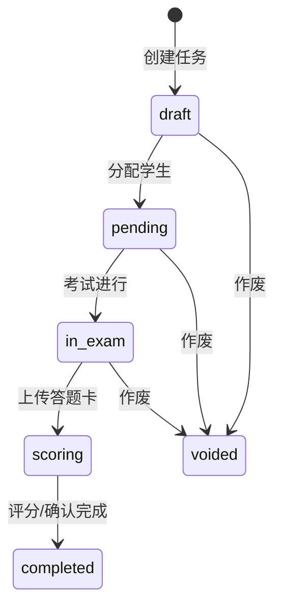

# 03 — 业务流程 BL(11 节模板,按业务域)

> 基线 `ff622a7`(v2.0.0) | 2026-08-29
> 原则: 用业务语言而非代码结构描述;每个域给出 角色→操作→端点→数据表 链路。

---

## 域 A — 组卷与答题卡模板

**1. 业务目的**: 从题库选题组成正式试卷,生成可打印的试卷/答题卡 Word 模板,为考试执行提供载体。
**2. 参与角色**: 教师(组卷)、管理员(组卷/模板管理)。
**3. 前置条件**: 题库中存在 active 题目;用户具有 paper:add/edit 权限。
**4. 主流程**:
1. 选题暂存: 教师在题库勾选题目 → `POST /api/v1/paper-drafts`(按用户覆盖式保存)→ `paper_drafts`
2. 创建试卷: `POST /api/v1/papers` → 后端按选题**快照** score/answer/analysis 写 `paper_questions` → 算总分 → `papers`(paper_code=P+日期+流水)
3. 生成答题卡布局: `POST /papers/{id}/answer-sheet` → `answer_sheet_templates.layout_config`(宽度规则: 单选多选15mm/判断10mm/填空40mm/解答=分值×10mm,`paper.py:88-114`)
4. 模板取用: 下载 Word 模板(懒生成)或上传自定义模板(source=user),可恢复系统默认(source=auto)
**5. 决策规则**:
| 条件 | 动作 |
|------|------|
| 删除题库题目 | `paper_questions.question_id` 置 NULL,**保留快照**(已组卷不受影响) |
| 上传模板 >10MB / 非 docx | 拒绝(zip+python-docx 校验) |
| 模板未自定义 | 懒生成系统默认并缓存 |
**6. 状态迁移**: papers.status: `draft / active / archived`;模板 source: `auto ⇄ user`
**7. 边界与异常**: 组卷草稿按 user_id 唯一,互不干扰;删除试卷为真删除,级联清评分/答题卡/任务(`paper.py:253-304`,**无 DB 级联,纯代码删除**)
**8. 数据触点**: papers, paper_questions, paper_drafts, paper_templates, answer_sheet_templates, questions
**9. 副作用**: python-docx 生成母版(机读带+四角对位+涂点/填空/方格三分区);图片经 `_resolve_image_enhanced` 兜底 http/data URI(`template_engine.py:75-90`)
**10. 断链与疑点**: 任务级模板继承试卷模板(`exam.py:658-677`),无独立任务模板覆盖
**11. 证据**: `backend/app/routers/paper.py:142-689`, `backend/app/routers/draft.py:33-56`, `backend/app/template_engine.py`

---

## 域 B — 考试执行与评分

**1. 业务目的**: 组织一场考试: 建任务→分配学生→打印答题卡→考后拍照上传→AI 识别评分→教师确认,产出三级看板。
**2. 参与角色**: 教师(创建者限定本人任务)、管理员;AI(识别/评分,外部视觉模型)。
**3. 前置条件**: 存在 active 试卷;教师有 exam 模块权限;AI 功能需前端传入可用 api_key。
**4. 主流程**:
1. 建任务 `POST /api/v1/exam-tasks`(task_code=T+日期+流水,可同时分配学生)→ `exam_tasks`
2. 分配 `POST /{id}/assign` → `task_assignments`(**记录创建时的 class_id 快照**,学生转班不影响历史)
3. 打印答题卡 `GET /{id}/answer-sheets/print` → 每生一页 A4 HTML(四角定位标+二维码)→ `answer_sheet_renderer.py`
4. 上传 `POST /{id}/answer-sheets`(image_urls+设备信息)→ `answer_sheets`,分配状态→uploaded
5. AI 识别 `POST /api/v1/ai/recognize-answer-sheet`(GLM-4V 读学号+逐题答案)→ 结构化 JSON
6. AI 评分 `POST /exam-tasks/answer-sheets/{id}/score` → `question_scores`(**满分占位桩**,`exam.py:312-355`)
7. 教师调分/确认 `PATCH /question-scores/{id}` → final_score(教师优先)+批注
8. 看板 `GET /{id}/dashboard` 实时聚合: 上传率/均分/分数段/逐题正确率(≥60%满分算对)/题型/难度/知识点得分率/低置信度(<0.7)计数
**5. 决策规则**:
| 条件 | 动作 |
|------|------|
| 教师访问非本人创建任务 | 403(creator_id 校验) |
| 上传答题卡 | 自动把对应 assignment 置 uploaded |
| 教师调分 | score_status→teacher_modified;确认→teacher_confirmed;final_score 取教师值 |
| ai_confidence < 0.7 | 看板单独计数提示复核 |
**6. 状态迁移**:

(六态枚举 `exam.py:18`;assignment 子状态: pending→uploaded→scored→confirmed)
**7. 边界与异常**: AI 评分失败可重跑(端点可重复调用);删除任务真删除级联 5 表(`exam.py:188-219`)
**8. 数据触点**: exam_tasks, task_assignments, answer_sheets, question_scores, papers, paper_questions
**9. 副作用**: 看板实时聚合不写库(`task_statistics` 表闲置,技术债 #9);识别/评分调用外部视觉 API
**10. 断链与疑点**: AI 评分桩未接真实模型(ai_raw_output={"stub":true});`format=pdf` 打印预留未实现
**11. 证据**: `backend/app/routers/exam.py:112-677`, `backend/app/routers/ai.py:162-213`, `backend/app/answer_sheet_renderer.py`

---

## 域 C — 题库建设与批量导入

**1. 业务目的**: 多渠道供题: 手工录入、文档导入(docx/OCR/智能)、教研云 AI 选题,统一编码入 `questions`。
**2. 参与角色**: 教师/教研管理员(需 question:add 或 sync:add 权限);外部 AI(OCR/文本模型);教研云题源。
**4. 主流程**:
1. 手工: `POST /api/v1/questions`(编码自动生成)+ 批量设分类/标签/删除
2. 文档导入: `POST /questions/import-docx|import-ocr|import-smart` → 返回题目 JSON(**不落库**)→ 前端预览 → `POST /questions/import`(source_id 去重)→ `POST /import-logs` 记录
3. 教研云: `POST /api/v1/ai/select-questions` 四步流水线 → `ai_selection_banks`(draft)→ 预览 → `POST /selections/{id}/confirm` 归一化落 `questions(source=jiaoyanyun)`
**5. 决策规则**:
| 条件 | 动作 |
|------|------|
| source_id 已存在 | 覆盖更新而非重复插入 |
| 本地题库候选不足 | 四级渐进放宽检索补足(上限 60,`ai_select.py:181-240`) |
| 教研云代理不可达 | 回退系统题库(`ai_select.py:399-425`) |
| AI 挑选异常 | 取前 N 兜底(`ai_select.py:384-385`) |
| 智能导入格式不明 | 伪装扩展名检测+30MB 上限拒绝 |
| 删除标签 | 全表扫描清洗 questions.tags JSON |
**6. 状态迁移**: questions.status: `active ⇄ archived`;ai_selection_banks.status: `draft → confirmed → synced`
**7. 边界与异常**: OCR 大 PDF 分页渲染(2x)+ 图片压至 2048px;图题输出 img_box 由后端裁剪原样插图
**8. 数据触点**: questions, question_images, categories, tags, import_logs, ai_selection_banks
**9. 副作用**: docx 图片落盘 `frontend/demo/images` 并内联;公式保留 MathJax SVG HTML
**10. 断链与疑点**: `import_export.py:34-36` sys.path 解析脆弱(仅 CWD=backend 时可用,技术债 #5)
**11. 证据**: `backend/app/routers/import_export.py:65-1149`, `backend/app/routers/question.py:44-359`, `backend/app/routers/ai_select.py:389-620`

---

## 域 D — 教研云对接(独立进程群,非 FastAPI 内)

**1. 业务目的**: 从教研云精品题库获取题目资源(带答案解析/公式/图片),供 AI 选题使用。
**2. 参与角色**: 运维人员(人工登录教研云)、Chrome CDP、同步脚本、:8787 代理、FastAPI(消费方)。
**3. 前置条件**: Chrome 持久化 profile 内已人工登录教研云;教研云网关 IP 白名单放行服务器。
**4. 主流程**:
1. `chrome_cdp_manager.py` 看护 Chrome(:9222)打开精品题库页,5s 探活自动拉起
2. `jiaoyanyun_sync.py` 经 playwright 从页面抓 Authorization 令牌 → 调教研云接口分页拉题+答案 → 转存 CDN 图片/提取 MathJax 公式 → 导出 `jiaoyanyun_export/`
3. `jiaoyanyun_proxy.py` :8787 提供统一查询面(live 实时查/offline 用缓存),FastAPI 与 demo SPA 直连消费
4. 运维操作面: POST /api/chrome/start|restart、/api/login(CDP 自动填表)、/api/auth/capture(抓令牌)、/api/logout
**5. 决策规则**:
| 条件 | 动作 |
|------|------|
| Chrome 掉线 | watchdog 自动重启 |
| 代理不可达 | 上层(FastAPI/SPA)回退本地题库或离线缓存 |
**7. 边界与异常**: 令牌/账密明文落盘(`jiaoyanyun_credentials.json`/`jiaoyanyun_token.json`,已入 .gitignore,技术债 #7)
**8. 数据触点**: 不直接写主库;产物经 AI 选题 confirm 进入 questions
**9. 副作用**: 独立日志 `jiaoyanyun/logs/jiaoyanyun_sync.log`;Chrome profile 数据沉淀
**11. 证据**: `jiaoyanyun/chrome_cdp_manager.py:135-163`, `jiaoyanyun/jiaoyanyun_sync.py:27-72`, `jiaoyanyun/jiaoyanyun_proxy.py:14-18,437-701`

---

## 域 E — 组织与账号(教师/班级/学生/用户)

**1. 业务目的**: 维护学校组织结构与账号体系,并为教师划定数据可见域。
**4. 主流程**:
1. 建教师 = 建 User(role=teacher,默认权限)+ Teacher + 回填工号 T{id:04d} + 互写 teacher_id(`teacher.py:105-140`)
2. 教师-班级关联(班主任每班唯一)→ 决定教师可见学生/班级/任务域
3. 学生建档(学号自动 A01-Z99,必须归属班级)→ 考后教师写评价(同任务去重覆盖)
4. 班级编号按学段前缀 A/B/C 自动生成;删除有学生则 409
**5. 决策规则**:
| 条件 | 动作 |
|------|------|
| 删除教师 | 级联 TeacherClass + 注销 User + 其任务 creator_id 置 NULL |
| 删除学生 | 级联 question_scores→answer_sheets→task_assignments→student_statistics |
| 删除班级(有学生) | 409 拒绝;TeacherClass 级联、assignment.class_id 置空 |
| 删除用户 | **软删除**(is_active=False,保留审计) |
| 删除分类(被引用) | 409 拒绝(扫描题目/试卷/任务/教师引用) |
**6. 状态迁移**: students/classes/teachers.status: `active/archived`;users.is_active 布尔
**9. 副作用**: 三个统计表(student/class/task_statistics)字段齐备但看板全走实时聚合,无写入方(技术债 #9)
**11. 证据**: `backend/app/routers/teacher.py:57-237`, `student.py:64-311`, `class_router.py:77-258`, `user.py:59-173`, `basic.py:151-196`

---

## 域 F — 错误归集与自动修复

**1. 业务目的**: 前后端错误统一归集、人工/AI 标记修复,形成可审计的错误闭环。
**4. 主流程**:
1. 前端错误(axios 拦截器/Vue errorHandler)与后端未捕获异常(全局 handler)→ `system_logs`(source=frontend/backend)
2. 管理员在错误日志页筛选/查看/标记修复(PATCH /{id}/repair 写 repaired_at/by/note)/删除
3. cron 4 次/日 `run_repair.sh` → `auto_repair.py`: HTTP 类非 Bug(401/404/400/405/413/409/422/403)自动标记已修复;TypeError/AttributeError/ProgrammingError 判为程序 Bug,尝试自动修复或生成建议;报告落 `logs/auto_repair_report.json`;有代码变更则自动 git 提交并重启服务
**5. 决策规则**:
| 条件 | 动作 |
|------|------|
| 未登录上报错误 | 允许(匿名,登录前也能报) |
| HTTP 4xx 类错误 | 判非 Bug,自动标记已修复 |
| 程序异常类错误 | 判 Bug,尝试自动修复/建议 |
| message 超长 | 截断至 4000 字符 |
**9. 副作用**: 自动修复会以 Auto Repair Bot 身份自动 commit(本次基线前服务器即此机制)
**10. 断链与疑点**: 旧 Vue SPA 上报端点 `/api/logs` 与新端点 `/api/v1/system-logs` 字段不匹配,Vue 端错误进不了新表(技术债 #12)
**11. 证据**: `backend/app/routers/system_log.py:44-157`, `backend/app/main.py:94-122`, `scripts/auto_repair.py:27-90`, `scripts/run_repair.sh`
